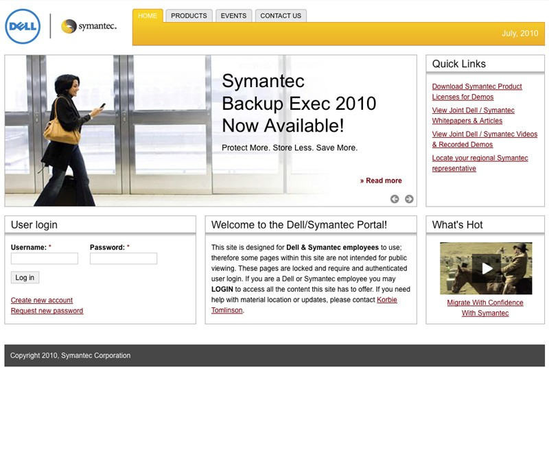

#{{ page.title }}

Working closely with Kevin Millecam of [WebWise Solutions](http://webwiseone.com) and the team at Dell, I was responsible for turning the design and ideas into a solid Drupal theme. I also designed and created the homepage carousel to clearly and easily promote upcoming products and news and add some interactivity to the site.

The site is very content-rich for the employees who log in and use the site on a daily basis so the theme had to be extremely lightweight and load quickly under heavy traffic. I implemented Skinr throughout the site to style blocks as needed and give the administrators full control over the display styles applied to each block.

---

##Contributions

* Drupal 6.x Theme
* HTML
* CSS

---

**Launched:** {{ page.launch_date }} {{ page.site_link }}

---

   

   

    
