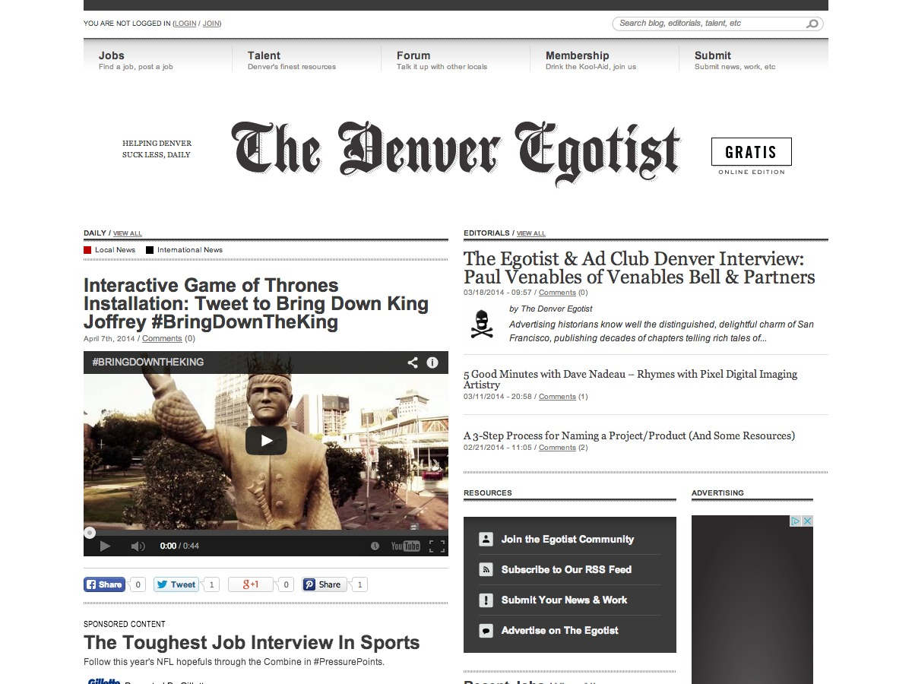
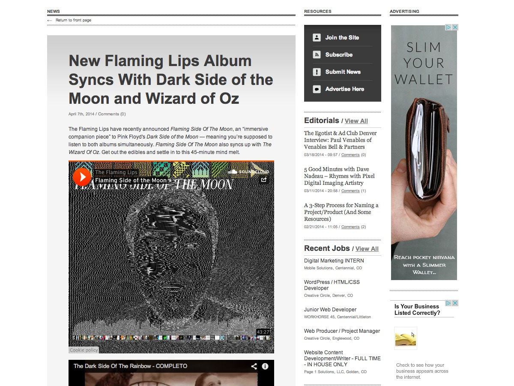
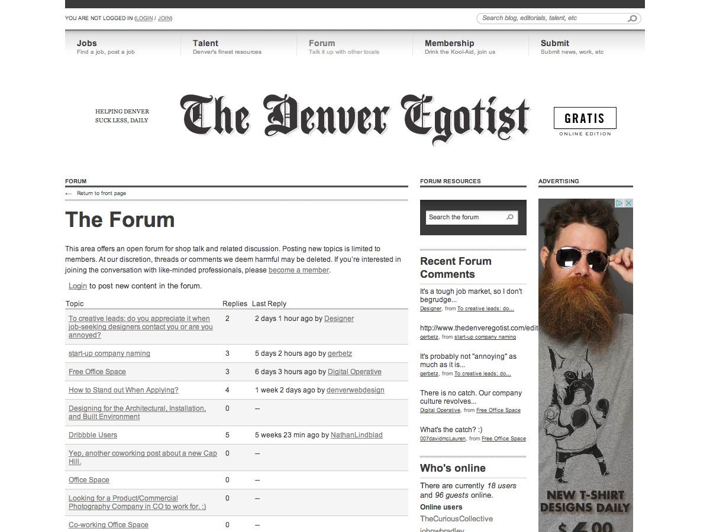
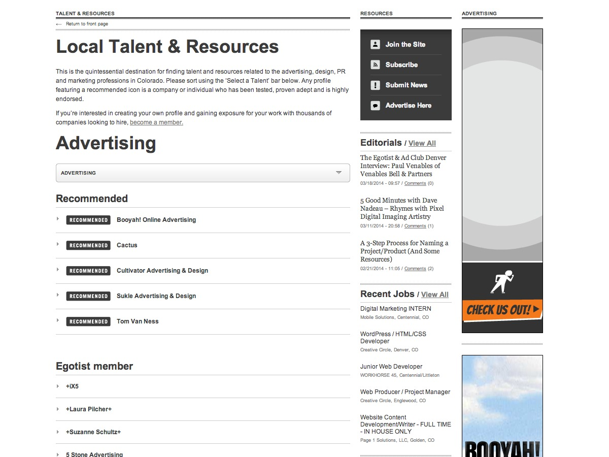

#{{ page.title }}

The Denver Egotist is an anonymously-run website featuring the best creative, the best talent and the best resources in Denver &mdash; keeping it all in the greater context of what’s happening internationally. Our intent is to foster growth in this city, both professionally and conceptually.

Working closely with the team at [General Projects](http://pieratt.com), I was responsible for the site development and theming for The Denver Egotist. We were provided very high quality design files and strict requirements for presentation. All of the content from the existing site was migrated and working within the new Drupal system.

[The Egotist Network](http://theegotistnetwork.com) is an exclusive platform built specifically to feature the work, talent, resources and point-of-view of your local creative market. The site rolled out in Denver and has since expanded to numerous other locations.

---

##Contributions

* Drupal 6.x Theme
* HTML
* CSS
* Site development
* Consulting

---

**Launched:** {{ page.launch_date }} {{ page.site_link }}

---

  

  

  

  
