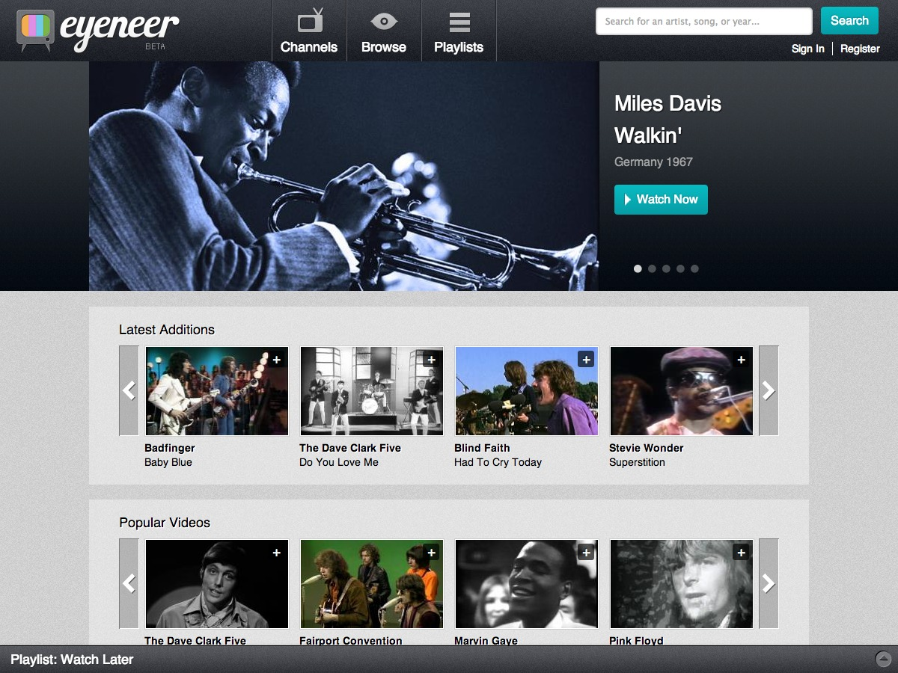

#{{ page.title }}

Eyeneer TV's mission is to help you find and enjoy the most amazing vintage music videos, when, where, and how you want to watch them. Eyeneer TV features thousands of legally licensed music videos, rare TV performances, unseen live concerts, artist interviews, original documentaries, music feature films, and more.

I was responsible for taking the client's designs and building a full-featured website powered by [Drupal](http://drupal.org). Users have the ability to log in and comment on videos, rate them, and add or remove them from their personal list of favorites for easy viewing. 

Also features a custom search results page displaying the title, thumbnail, and description of the video to help the user easily find what they are looking for.

---

##Contributions

* Drupal 6.x Theme
* Site development
* HTML
* CSS
* Consulting

---

**Launched:** {{ page.launch_date }} {{ page.site_link }}

---

  

  

  
