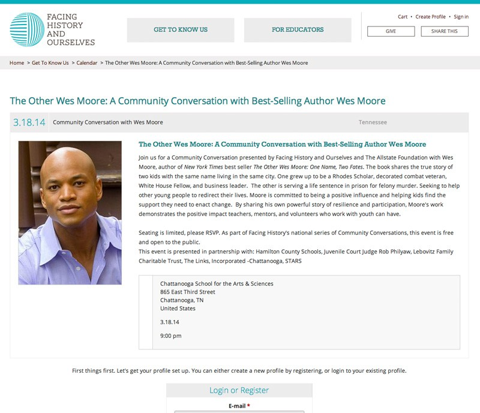

#{{ page.title }}

I worked as a contractor with the team at [ThinkShout](http://www.thinkshout.org) for this project. 

They handled building the Drupal site and working with the client get get exactly what they wanted. I took their vision and turned it into a fully responsive site that works on as many devices as possible.

We had mockups to use for reference but they were unfinished and incomplete. I used them as direction for designing and building elements throughout the site and creating a look and feel that was consistent and filled in the gaps in the design as needed.

Be sure to check out [ThinkShout's full case study](http://thinkshout.com/work/facing-history) on this project for more information.

---

##Contributions

* Drupal 7.x Responsive Theme
* HTML
* SASS/CSS
* Consulting
* Design direction

---

**Launched:** {{ page.launch_date }} {{ page.site_link }}

---

   

   

   

   

   
