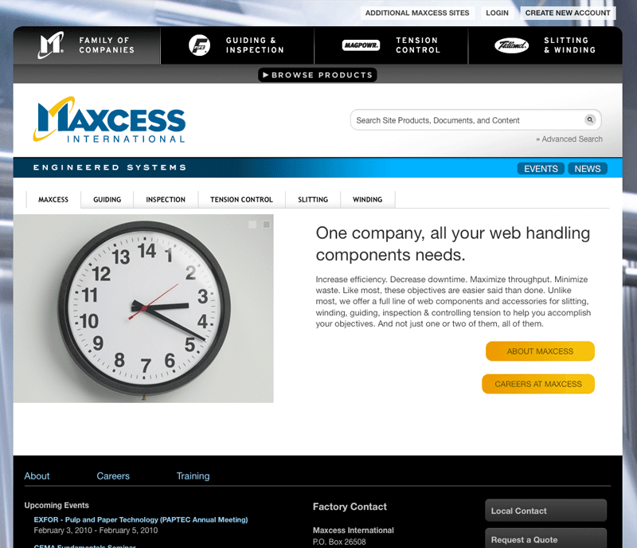
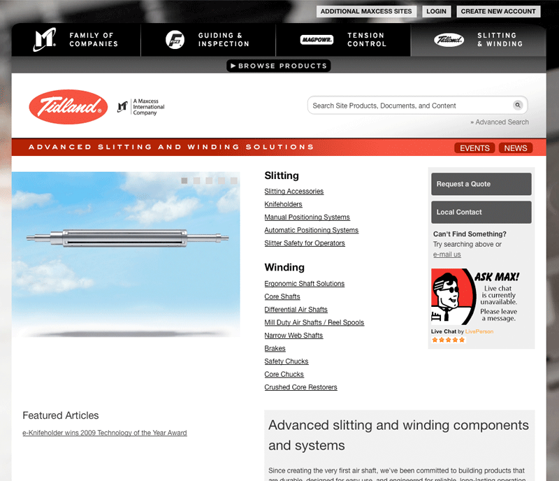
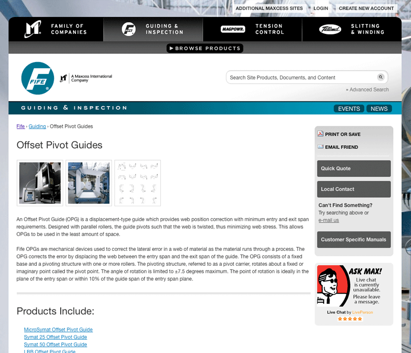
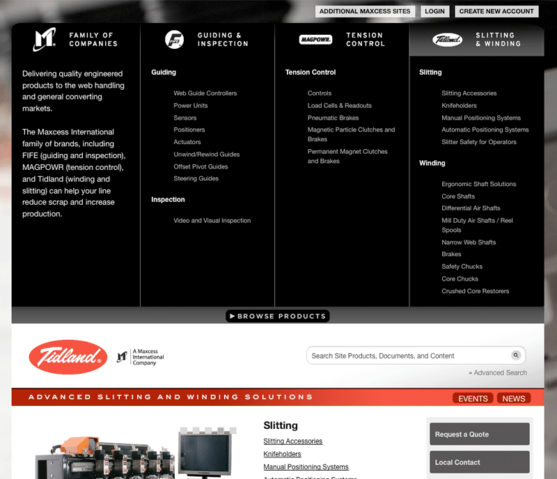
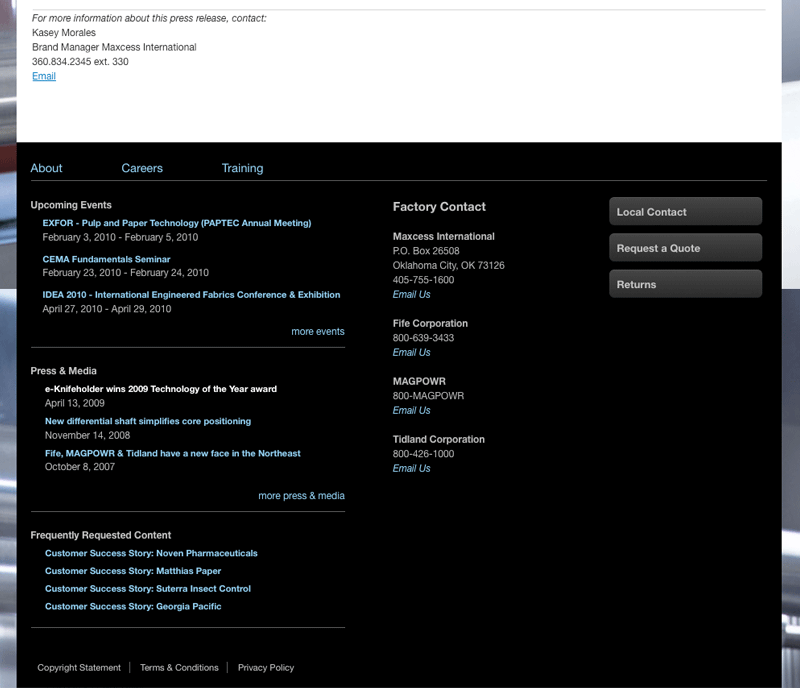

#{{ page.title }}

As the parent company to three of the web handling industry leading names, Fife, MAGPOWR and Tidland, they have over 160 combined years of innovative products and technological know-how at your disposal. From general rewind/unwind machine components to custom-built guiding systems, to web tension control, they can deliver everything you need to make your operations run faster, straighter, and more efficient.

Working closely with the team at Wolverine, I was responsible for the creating the Drupal theme for Maxcess International. We were responsible for taking very high quality design files and translating them to a working Drupal 6.x theme as well as integrating the design into the modules used on the site.

---

##Contributions

* Drupal 6.x Theme
* HTML
* CSS

---

**Launched:** {{ page.launch_date }} {{ page.site_link }}

---

   

   

   

   
