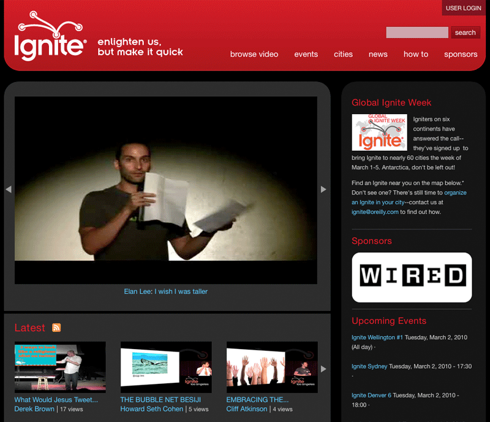
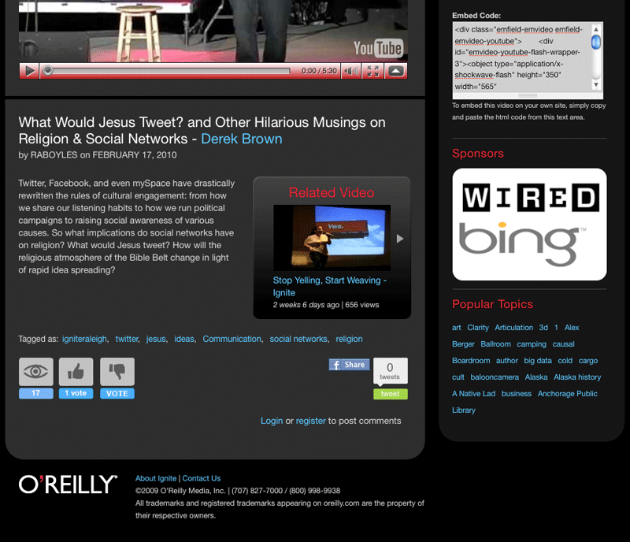
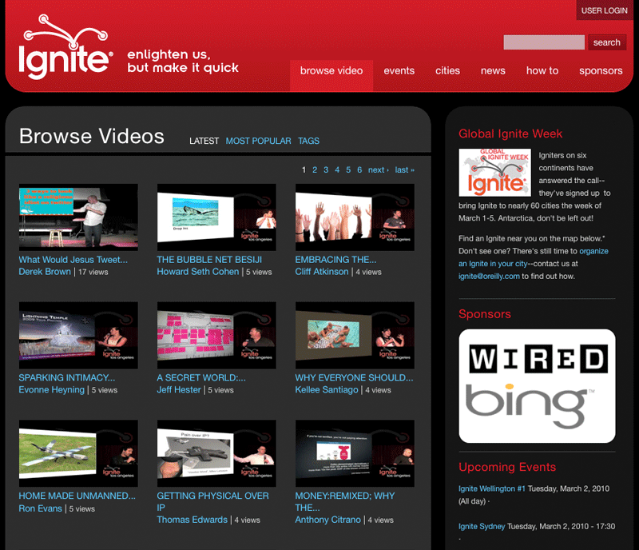
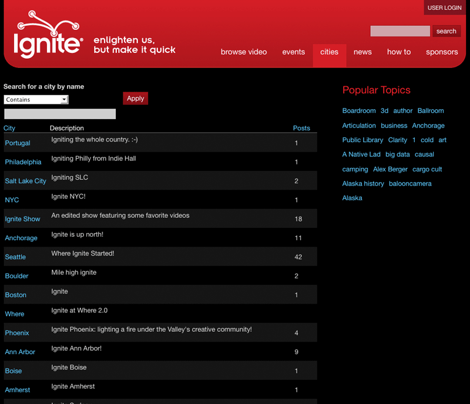
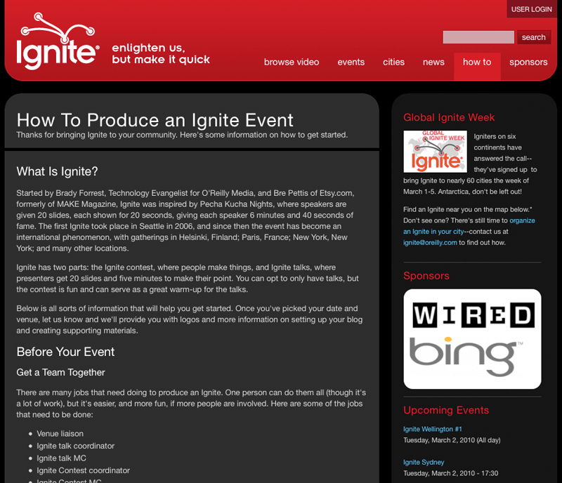

#{{ page.title }}

Started by Brady Forrest, Technology Evangelist for [O'Reilly Media](http://oreilly.com), and Bre Pettis of [Etsy](http://etsy.com), formerly of [MAKE Magazine](http://makezine.com), Ignite was inspired by Pecha Kucha Nights, where speakers are given 20 slides, each shown for 20 seconds, giving each speaker 6 minutes and 40 seconds of fame. The first Ignite took place in Seattle in 2006, and since then the event has become an international phenomenon, with gatherings in Helsinki, Finland; Paris, France; New York, New York; and many other locations.

Working closely with the team at [Rapid Waters Development](http://rapidwatersdev.com), I was responsible taking Ignite's designs and turning them into a working Drupal 6.x theme. We used Panels throughout the site and created a custom Panels layout as well as a custom Panels style so we can easily apply the look and feel of the two column layout through the site and still have the logic and functionality within Panels.

---

##Contributions

* Drupal 6.x Theme
* HTML
* CSS

---

**Launched:** {{ page.launch_date }} {{ page.site_link }}

---

   

   

   

   

