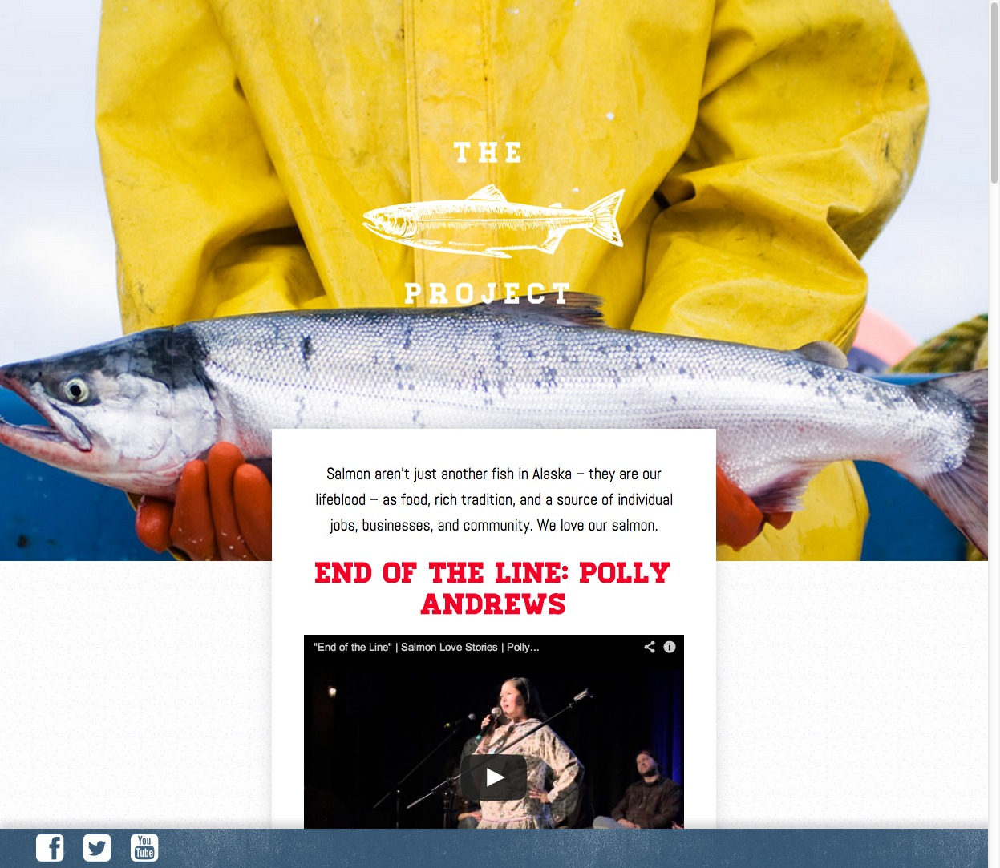

#{{ page.title }}

Working closely with the team at [ThinkShout](http://www.thinkshout.org) I developed a fully responsive Drupal theme. They handled the backend development and I was responsible for turning that markup into a responsive site that works well on as many devices as possible.

Be sure to check out [ThinkShout's full case study](http://thinkshout.com/work/the-salmon-project) on this project for more information.

---

##Contributions

* Drupal 7.x Responsive Theme
* HTML
* SASS/CSS
* Consulting
* Design direction

---

**Launched:** {{ page.launch_date }} {{ page.site_link }}

---

   

   
