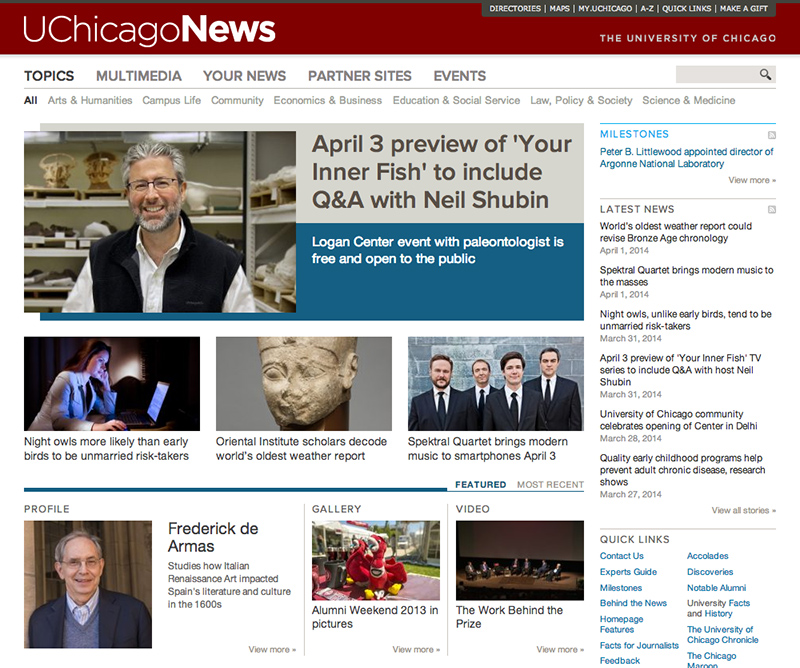
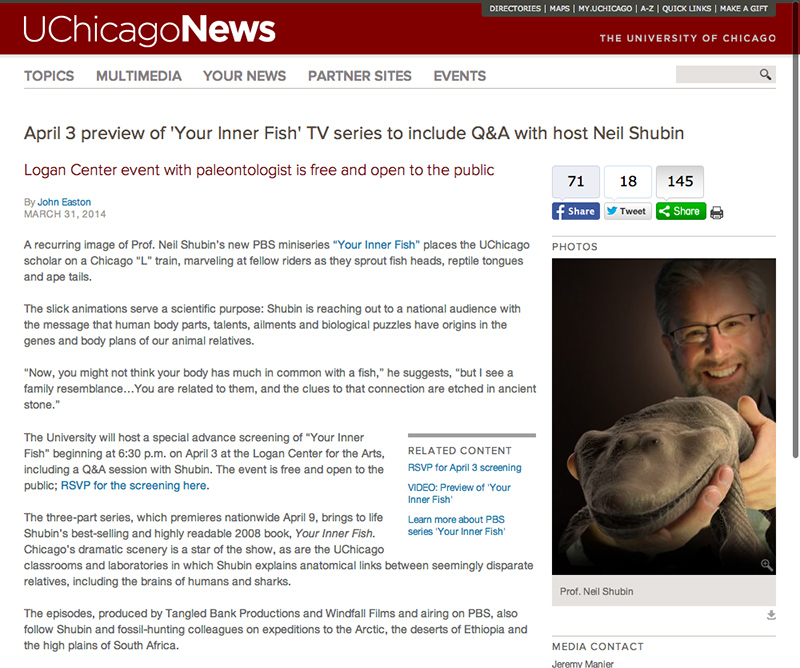
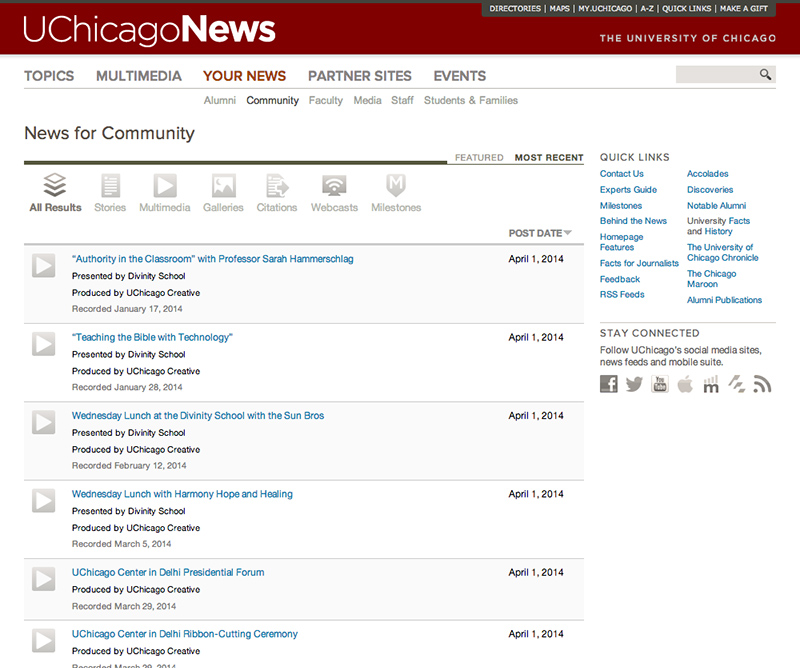
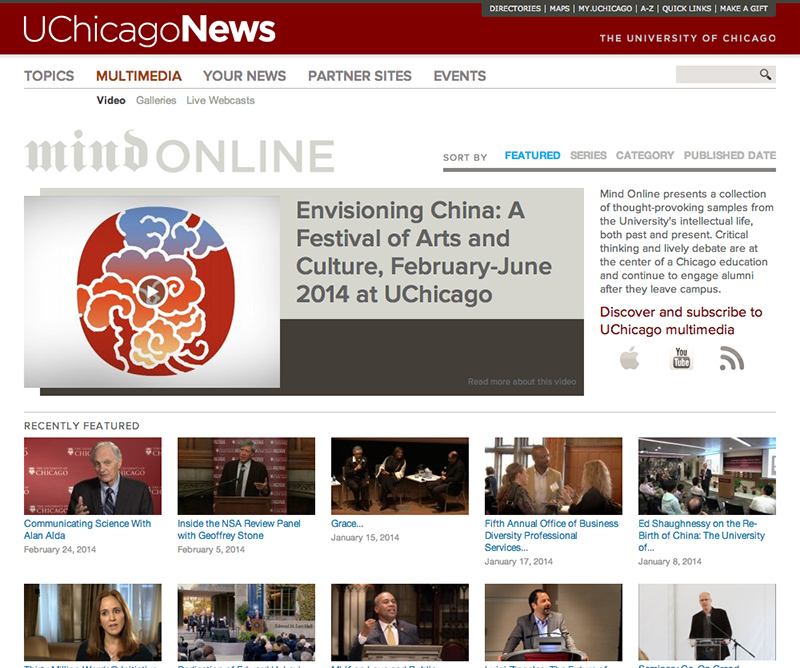

#{{ page.title }}

I worked as a contractor with the team at University of Chicago to develop their news site. We designed and built each page to fit the look and feel of the main site yet be unique enough to stand on it's own.

The site is built in Drupal 6.x and relies on Panels and Views quite heavily. Consideration and development was given to the administration side of the site as students and editors were able to post articles and media to the site.

---

##Contributions

* Drupal 6.x Theme
* HTML
* CSS

---

**Launched:** {{ page.launch_date }} {{ page.site_link }}

---

   

   

   

   
